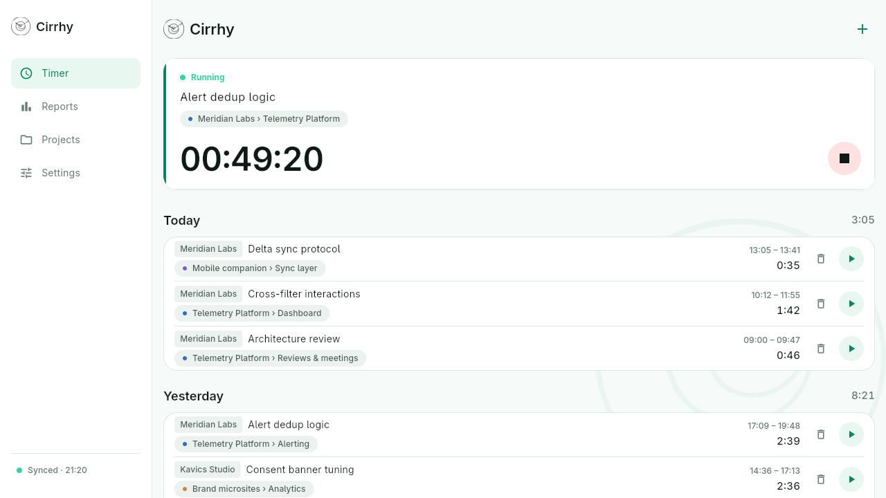
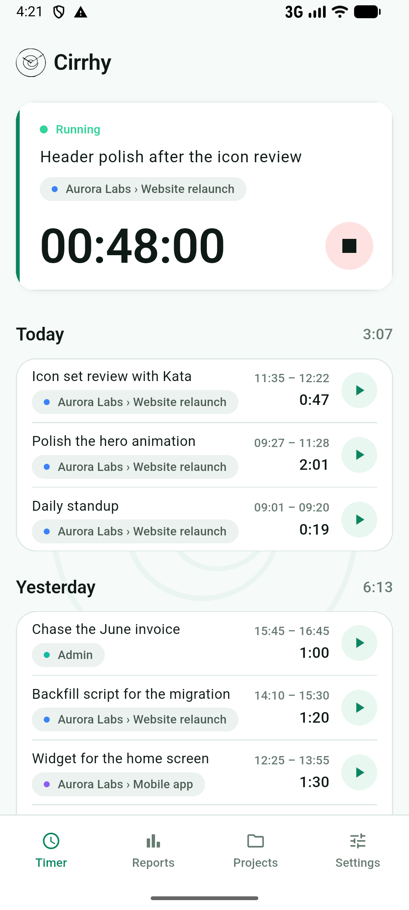
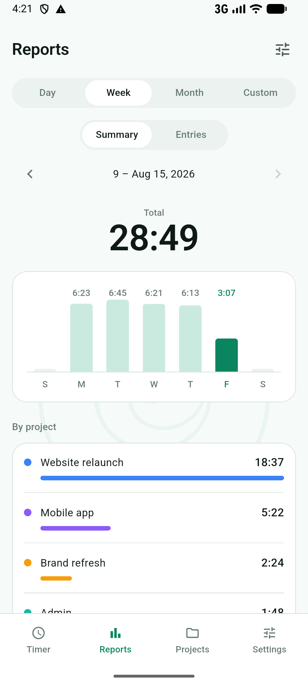
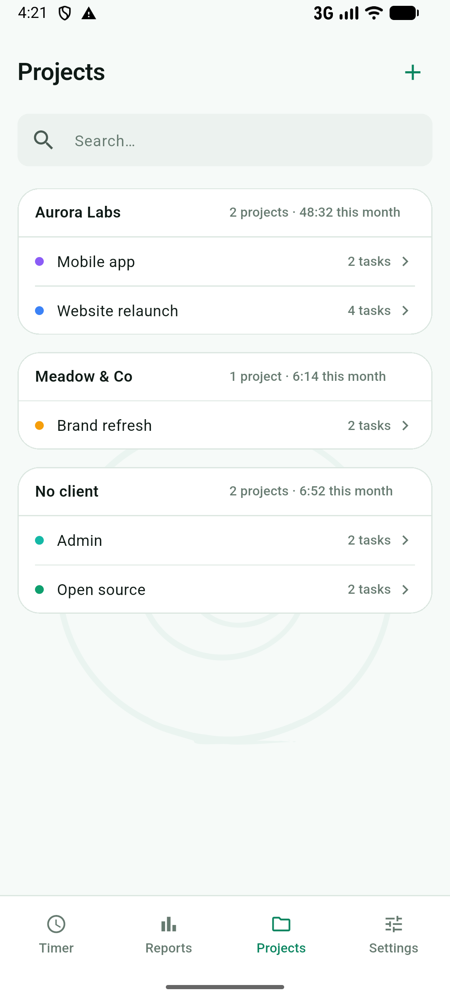
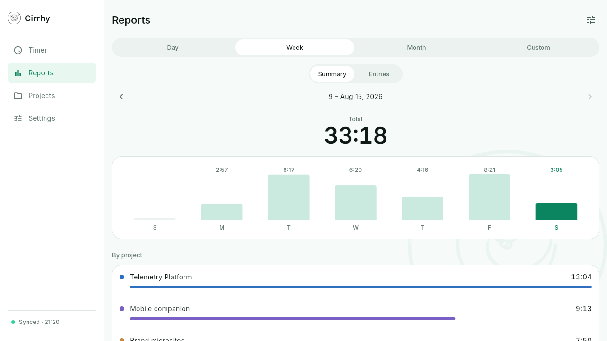
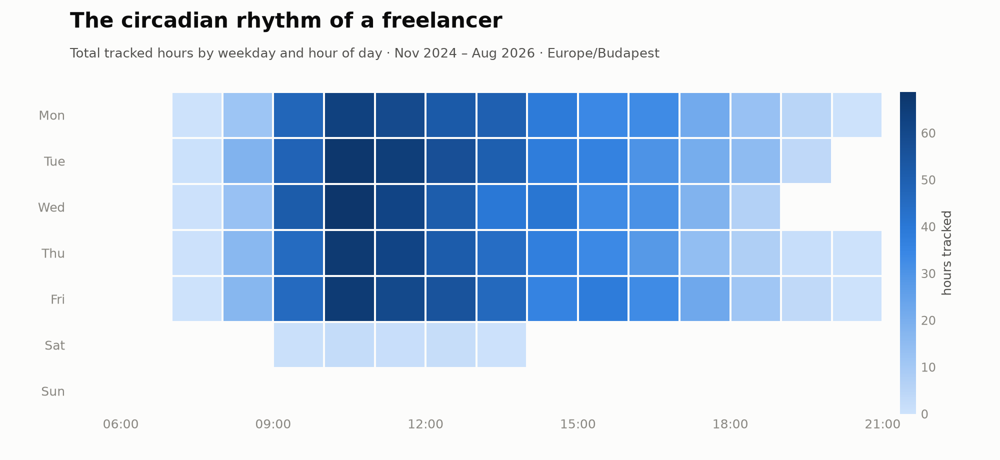

# Cirrhy

**A personal FREE OSS time tracker that keeps everything you track in a single file YOU OWN.**

[](LICENSE)
[](https://flutter.dev)

The name is short for *circadian rhythm*. Cirrhy takes the useful core of tools
like Clockify, Toggl and Kimai — clients, projects, tasks, a running timer,
reports — and strips away the team dimension: no accounts, no server, no
sharing, no cloud. One person, five platforms (Linux, Android, Windows, macOS,
iOS), and all data in one `cirrhy.json` in a folder you choose.

Syncing is deliberately *your* problem, which makes it your choice: keep the
folder in the cloud you already use — Dropbox, iCloud Drive, Nextcloud,
Syncthing — and point every device at it. Cirrhy contains no network code at
all; instead it is built, from the storage layer up, to never assume it owns
the file exclusively.

## A look around

<p align="center">
  
</p>

| Timer | Reports | Projects |
|:---:|:---:|:---:|
|  |  |  |

<p align="center">
  
</p>

- **One-tap restart.** The main screen is the running timer plus your recent
  work; every past entry has a run button that starts a new timer from it.
  That is the primary interaction, and the data model is shaped around it.
- **Clients → projects → tasks**, with time entries hanging off them, colours
  per project, billable flags.
- **Reports** over day, week, month or any custom range — summary charts and
  per-project totals, or the raw entry list.
- **Five languages** out of the box (English, magyar, español, italiano,
  Deutsch), and adding a sixth costs one translation file, no code. Fair
  warning: the translations have not been validated by native speakers yet.
- **Light and dark**, following the system or overridden per device.

## The single file

Everything Cirrhy knows lives in one human-readable JSON document. Two devices
editing it between syncs is the normal case, not a conflict to error out on:

- Saving is always **read-merge-write** against what is currently on disk,
  never a blind overwrite. Change is detected by content hash, not mtime,
  because sync clients rewrite mtimes for their own reasons.
- Merge happens at the **record** layer — a union over stable UUIDs with
  newer-wins — never at the file layer. The merge is commutative and
  idempotent, and the test suite enforces both.
- The loser of a conflict is **demoted into per-record history**, not
  destroyed. Deletions leave tombstones, so a merge cannot resurrect them.
- The **running timer is per-device**. Two timers left running on two devices
  surface for reconciliation instead of one silently discarding the other.
- Writes go to a temp file that is renamed over the original, so a crash
  mid-save cannot half-write your history. (Android's storage framework
  cannot rename-over, so there a backup is taken before each in-place write.)

The full rationale — including why there is no SQLite, no WebDAV client and no
default storage location — lives in [DESIGN.md](DESIGN.md). The merge engine
itself is a pure-Dart package with no UI dependencies,
[`packages/cirrhy_merge`](packages/cirrhy_merge), tested headless.

## Status

Early days, honestly labelled: the screens above are real, but the project is
pre-release. **Linux, Android, macOS and iOS are built and tested** (Android
on an emulator, the Apple targets on a MacBook); Windows is scaffolded but
untested. There are no prebuilt binaries, no CI and no store listings yet, so
until those exist, building from source is the way in.

## Building from source

### Prerequisites

- **Flutter 3.44** (Dart SDK ≥ 3.12) — [install guide](https://docs.flutter.dev/get-started/install).
  Run `flutter doctor` and let it tell you what your platform still needs:
  - *Linux:* clang, CMake, ninja, pkg-config, GTK 3 headers.
  - *Android:* the Android SDK (Android Studio or command-line tools).
  - *macOS / iOS:* Xcode, on a Mac.
  - *Windows:* Visual Studio with the C++ desktop workload.
- `git`

### Get and build

```sh
git clone https://github.com/lorands/cirrhy.git
cd cirrhy
flutter pub get        # resolves the workspace, generates localizations

tool/host-auto.sh --release        # builds everything this host can build
```

The `tool/` scripts exist because `flutter build` only works from `app/`,
never from the workspace root — they handle that, run from anywhere, and each
refuses politely on a host that cannot build its target. `--debug` is the
default; pass `--release` for something worth installing. See
[`tool/README.md`](tool/README.md) for the full set.

### Linux

```sh
tool/target-linux.sh --release
```

The result is a self-contained bundle — run it from where it is, or copy it
wherever you like:

```sh
app/build/linux/x64/release/bundle/cirrhy
```

### Android

```sh
tool/target-android.sh --release
adb install app/build/app/outputs/flutter-apk/app-release.apk
```

Release builds are currently debug-signed, so they install on any device with
developer mode but will be replaced by properly signed builds once releases
exist. `tool/target-android.sh --aab` produces the Play Console format.

### Windows

```sh
tool/target-windows.sh --release       # on a Windows host
```

The runnable app lands under `app/build/windows/`. Untested so far — reports
welcome.

### macOS and iOS

```sh
tool/target-macos.sh --release         # on a Mac
tool/ios-signing.sh <TEAM-ID>          # once; a free personal team is enough
tool/run-ios.sh --release              # builds and installs on a paired iPhone
```

A free Apple developer team suffices — the app declares no entitlements that
need a paid membership — with the usual personal-team limits (seven-day
expiry; re-running the install command reinstalls over the top and keeps your
data).

### First run

Cirrhy asks you to pick a folder before anything else. To use it across
devices, the proposed setup is a cloud-synced folder — Dropbox, iCloud Drive,
Nextcloud, Syncthing, whatever already syncs your files — and picking that
folder on every device. The file name is fixed (`cirrhy.json`), so setting up
a second device is the same flow as the first: point it at the same synced
folder and the existing document is adopted and merged, not replaced. A single
device works just as well with any local folder; the cloud is a choice, not a
requirement.

### Developing

```sh
tool/dev.sh            # desktop + mobile side by side, one hot reload for both
tool/check.sh          # flutter analyze + formatting report
tool/test.sh           # engine suite, then app suite
```

## Importing from another tracker

Cirrhy ships no importers, deliberately. Every tracker's export is a dialect
that changes without notice, and a migration is a one-time job — so instead
of a shelf of brittle vendor parsers, the **file format itself is the import
seam**, specified well enough that something which has never seen this
codebase can produce a valid document. In practice that something is an AI
agent (Claude or equivalent): it reads your export, makes the vendor-specific
mapping judgements, and writes the records straight into your live
`cirrhy.json`, which the app picks up on its next refresh exactly as it would
another device's edits.

The whole contract lives in two files next to the engine:

- [`packages/cirrhy_merge/doc/llms.md`](packages/cirrhy_merge/doc/llms.md) —
  the agent-facing guide: the entity model, the rules an importer must
  follow, and the rollback protocol.
- [`packages/cirrhy_merge/doc/cirrhy-document.schema.json`](packages/cirrhy_merge/doc/cirrhy-document.schema.json)
  — a JSON Schema the agent validates its output against before writing.

So a migration is one conversation:

> Import my Kimai export at `~/exports/kimai.csv` into my Cirrhy document at
> `~/Sync/cirrhy/cirrhy.json`. Follow `packages/cirrhy_merge/doc/llms.md` and
> validate against `packages/cirrhy_merge/doc/cirrhy-document.schema.json`.
> Show me the client/project mapping table.

There is no import mode and no review gate, because there doesn't need to be
one: every imported record is stamped with its batch (`importSource`) and its
identity in the source system (`externalId`), so a wrong mapping is undone by
tombstoning the batch and re-running — recovery over prevention. Review the
result in Reports before you start hand-editing imported entries, though: a
rollback takes edits made to the batch with it. And this is not theory — a
year of real Kimai history, 211 entries, came across in exactly one such
conversation.

## Reporting beyond the app

The Reports screen covers the everyday questions. Past it — arbitrary
pivots, charts, spreadsheets for a client, "which project ate my March?" —
Cirrhy deliberately ships no report builder. The same two files that make
the format the import seam make it the *reporting* seam: hand an agent your
`cirrhy.json` and ask, and it has everything it needs to answer correctly.

> Build a billable timesheet for Meridian Labs, Q2 2026, from my Cirrhy
> document at `~/Sync/cirrhy/cirrhy.json`, as an `.xlsx` — a summary by
> project and task, plus the full entry list.

[docs/reporting](docs/reporting) holds a full-size example document
(21 months, ~1,400 entries, the shape a real file accumulates) and three
artifacts produced from it exactly that way — two charts and a spreadsheet,
each shown with the prompt that made it:

<p align="center">
  
</p>

For Claude there is a packaged skill,
[`.claude/skills/cirrhy-report`](.claude/skills/cirrhy-report), bundling the
schema, the agent guide and the semantics a correct report needs (durations,
timezones, tombstones, history, archived-versus-deleted) — copy it into
`~/.claude/skills/` and a conversation needs only your file and the
question. Reporting through it is read-only by design; when you instead want
the file *changed*, the import rules above apply.

## Adding a language

Copy `app/lib/l10n/app_en.arb` to `app_<code>.arb`, translate, add the code to
the `shipped` set in `app/test/l10n_test.dart`, and run `flutter pub get`.
Nothing else enumerates locales; the test suite verifies every file carries
exactly the template's keys, so a missing string is a failing test rather than
silent English. What the tests cannot verify is the translations themselves —
the shipped ones await a native speaker's eye, and corrections are as welcome
as new languages.

## License

[Apache 2.0](LICENSE). Copyright 2026 Lóránd Somogyi.
