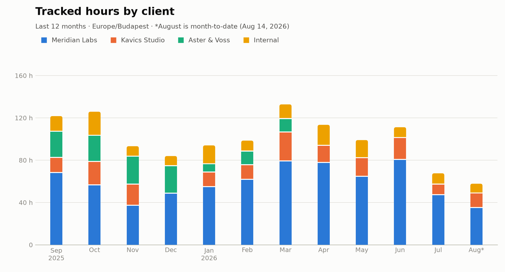

# Reporting on a Cirrhy document — worked examples

Cirrhy's Reports screen answers the everyday questions. For everything past
it — arbitrary pivots, charts, spreadsheet exports — the app deliberately
ships no report builder: your `cirrhy.json` plus the format contract
([schema](../../packages/cirrhy_merge/doc/cirrhy-document.schema.json),
[agent guide](../../packages/cirrhy_merge/doc/llms.md)) is everything an AI
agent needs, and [DESIGN.md §12](../../DESIGN.md) explains why that is a
feature. Every artifact below was produced from nothing but the example
document and the quoted prompt.

## The example document

[`cirrhy.json`](cirrhy.json) is a full-size, entirely fictional document:
21 months of a freelancer's tracking (November 2024 – August 2026), **1,397
entries and 2,154 tracked hours** across three clients, seven projects and
23 tasks. It has the shape a real file accumulates, which flat sample data
never does:

- the first eight months came in as one agent-driven **import batch** from
  Kimai, so those records carry `importSource`/`externalId` provenance;
- edited records carry **`history`** (prior versions demoted by merge), one
  project was renamed, one client and two projects archived;
- deletions left **tombstones**, and `runningTimers` is empty — a document
  at rest.

It is generated, never hand-edited: `python3 tool/gen_example_document.py`
reproduces it byte for byte, and the engine's test suite keeps it in the
codec's exact canonical form — the file is provably one the app itself would
write. To poke at it in the app, point Cirrhy at a *copy* in a scratch
folder; pointing at this folder would adopt the document and start merging
your edits into it.

## Example 1 — where the year went

> My Cirrhy document is `docs/reporting/cirrhy.json`. Chart my tracked hours
> over the last 12 months, monthly, stacked by client, as a PNG.



One client winding down (Aster & Voss, gone after March), one ramping up in
its place, and a July that is visibly a vacation.

<details>
<summary>The numbers behind the chart</summary>

| Month | Meridian Labs | Kavics Studio | Aster & Voss | Internal | Total |
|---|---:|---:|---:|---:|---:|
| Sep 2025 | 68.7 | 14.4 | 24.7 | 13.8 | 121.6 |
| Oct 2025 | 57.1 | 22.2 | 24.7 | 21.8 | 125.8 |
| Nov 2025 | 37.9 | 20.0 | 26.3 | 9.0 | 93.2 |
| Dec 2025 | 49.4 | — | 25.9 | 8.6 | 83.9 |
| Jan 2026 | 55.5 | 13.9 | 7.6 | 16.9 | 94.0 |
| Feb 2026 | 62.4 | 13.9 | 12.8 | 9.3 | 98.5 |
| Mar 2026 | 79.7 | 27.4 | 12.7 | 12.9 | 132.7 |
| Apr 2026 | 78.4 | 16.1 | — | 18.9 | 113.4 |
| May 2026 | 65.2 | 17.6 | — | 16.2 | 99.0 |
| Jun 2026 | 81.2 | 20.7 | — | 9.3 | 111.1 |
| Jul 2026 | 47.9 | 10.0 | — | 9.7 | 67.6 |
| Aug 2026* | 35.8 | 13.7 | — | 8.3 | 57.7 |

\*month to date (Aug 14, 2026) · hours · Europe/Budapest

</details>

## Example 2 — the eponymous rhythm

> Where does my week actually go? From `docs/reporting/cirrhy.json`,
> heat-map my tracked time by weekday and hour of day, in my local time,
> over the whole document.


The lunch dip, the fade after 16:00, a thin stripe of Saturday open-source
work, Sundays untouched. Cirrhy is short for *circadian rhythm*; this is
that, measured.

## Example 3 — a timesheet your client can open

> Build a billable timesheet for Meridian Labs, Q2 2026, from
> `docs/reporting/cirrhy.json`, as an `.xlsx`: a summary sheet by project
> and task with monthly columns and totals, and a second sheet with the
> full entry list. Times in Europe/Budapest.

[`timesheet-meridian-2026q2.xlsx`](timesheet-meridian-2026q2.xlsx) — 144
entries, 220.1 billable hours. The summary's totals are live `SUM` formulas,
the entries sheet has a frozen header row and autofilter, so it lands as a
spreadsheet to work in, not a dump.

## Doing this to your own file

With Claude, install the packaged skill once — it bundles the schema, the
agent guide and the reporting semantics, so afterwards a prompt needs only
your file's path and the question:

```sh
cp -r .claude/skills/cirrhy-report ~/.claude/skills/
```

(Inside this repository the skill is already active.) With any other capable
agent, do what the prompts above do and point it at the two contract files
in [`packages/cirrhy_merge/doc/`](../../packages/cirrhy_merge/doc/).

Reporting is read-only by design — the skill instructs the agent to never
write your document for a reporting task. Writing (imports, batch edits,
rollbacks) has its own rules; those live in the agent guide and in the
[README's import section](../../README.md#importing-from-another-tracker).
